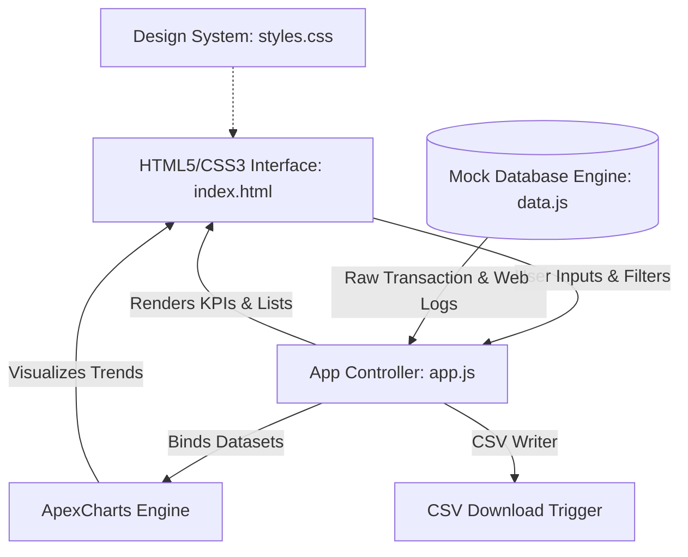

# AuraSales: Sales Performance & Predictive Analytics Dashboard
## Technical Documentation & Actionable Strategy Report

---

## 1. Executive Summary & Problem Analysis

### 1.1 The Challenge
Modern businesses operate in a data-rich but insight-poor environment. Transaction records, marketing spend, website traffic logs, and inventory data are often scattered across siloed tools (CRM, ERP, Google Analytics, Stripe, etc.). Consequently, business leaders lack:
1. **Real-time visibility** into sales metrics, leading to delayed pricing and inventory decisions.
2. **Predictive simulation capabilities**, leaving them unable to assess the financial impact of changing pricing or marketing ad budgets prior to committing funds.
3. **Automated anomaly monitoring**, leading to missed alerts when acquisition margins collapse.

### 1.2 The Solution: AuraSales
AuraSales addresses these challenges by consolidating transactional data into a single glassmorphic dashboard interface containing four core analytical modules:
*   **Performance Dashboard**: Aggregates sales volume, revenue, profit margins, and online web conversion rates.
*   **Sales Explorer**: Provides granular querying, multi-column sorting, search filters, and standard CSV exports for ad-hoc audit capability.
*   **Predictive Scenario Planner**: Implements a microeconomic simulation model to forecast revenue and net profit under variable marketing, pricing, and web CRO configurations.
*   **Metric Guardrails & Alerting**: Monitors KPIs against custom business boundary rules to surface anomalies immediately.

---

## 2. Technical System Architecture

AuraSales is designed with a lightweight, decoupled frontend architecture that runs entirely client-side for rapid deployment and audit.



### 2.1 File Structure
1.  **[index.html](file:///d:/Sadre/index.html)**: Establishes a responsive HTML grid system, custom range sliders, data grids, and tab panels. It draws icons from Lucide CDN and charting capabilities from ApexCharts CDN.
2.  **[styles.css](file:///d:/Sadre/styles.css)**: Implements visual excellence using a high-fidelity dark-mode glassmorphic framework. It utilizes Outfit and Inter font families, custom variables for color tokens, custom slider tracks, and state-switch animations.
3.  **[data.js](file:///d:/Sadre/data.js)**: A procedural generator that crafts 850 transactional history files spanning 12 months. It seeds seasonality curves (holiday spikes in Nov/Dec, retail discount flags) and yields functions to isolate, filter, and summarize dataset trends.
4.  **[app.js](file:///d:/Sadre/app.js)**: Runs routing, filter binding, multi-column search, scenario forecast simulations, and custom rules evaluation.

---

## 3. Mathematical & Simulation Models (Scenario Planner)

The **Predictive Scenario Planner** allows executives to forecast sales outputs by adjusting three sliders. Rather than using simple linear scaling, the application executes a mathematical model reflecting standard microeconomic theories:

### 3.1 Marketing Spend & Traffic Volume
Ad spend drives traffic, but exhibits **diminishing marginal returns** (scale fatigue).
$$Traffic_{sim} = Traffic_{base} \times M^{0.5}$$
*   Where $M$ is the ad spend multiplier (0.5x to 3.0x).
*   The square-root exponent ($0.5$) models diminishing returns: quadrupling ad spend ($M = 4$) only doubles incoming customer volume.

### 3.2 Pricing Elasticity of Demand
Changes in product price affect client purchase intent.
$$Quantity_{multiplier} = M^{0.5} \times (1 + \omega \cdot CRO_{gain}) \times (1 + \epsilon \cdot Price_{adj})$$
*   Where $Price_{adj}$ is the percent change in average item price (-20% to +20%).
*   $\epsilon$ represents the **Price Elasticity of Demand**, set to a realistic baseline of **$-1.2$** (meaning a 10% increase in price leads to a 12% drop in transaction volume).
*   $CRO_{gain}$ is the conversion optimization improvement.
*   $\omega$ represents the conversion impact factor ($0.6$).

### 3.3 Projected Revenue & Margins
$$Revenue_{sim} = Revenue_{base} \times Quantity_{multiplier} \times (1 + Price_{adj})$$
$$COGS_{sim} = COGS_{base} \times Quantity_{multiplier}$$
$$MarketingCost_{sim} = MarketingCost_{base} \times M$$
$$Profit_{sim} = Revenue_{sim} - COGS_{sim} - MarketingCost_{sim}$$

This model ensures that dropping prices by 20% might drive unit volumes higher but compresses margins and nets lower total profit, while increasing pricing expands margins until volume drop-offs counteract the pricing advantage.

---

## 4. Production Integration Roadmap

To transition this high-fidelity prototype into a production enterprise data application, we recommend the following three-tier cloud integration:

### 4.1 Database Layer (Snowflake / PostgreSQL)
In production, transaction logs should feed directly from payment systems (Stripe, Shopify API) or a database schema.
```sql
-- Production Transaction Fact Table Schema
CREATE TABLE fact_sales_transactions (
    transaction_id VARCHAR(50) PRIMARY KEY,
    transaction_date TIMESTAMP WITH TIME ZONE NOT NULL,
    product_id VARCHAR(20) REFERENCES dim_products(product_id),
    quantity INTEGER NOT NULL CHECK (quantity > 0),
    unit_price NUMERIC(10, 2) NOT NULL,
    discount_amount NUMERIC(10, 2) DEFAULT 0.00,
    gross_revenue NUMERIC(10, 2) GENERATED ALWAYS AS (quantity * unit_price - discount_amount) STORED,
    region VARCHAR(50) NOT NULL,
    sales_channel VARCHAR(30) NOT NULL,
    customer_segment VARCHAR(20) NOT NULL,
    customer_acquisition_cost NUMERIC(8, 2) DEFAULT 0.00
);
```

### 4.2 Data Pipeline (dbt & Apache Airflow)
To populate aggregations for rapid dashboard rendering:
1.  **Ingestion**: Airflow orchestrates hourly syncs from Stripe/Shopify to raw database layers.
2.  **dbt (Data Build Tool)**: Runs SQL models to transform transactional facts into aggregated monthly metrics:
```sql
-- dbt Model: monthly_sales_metrics.sql
SELECT
    DATE_TRUNC('month', transaction_date) AS sales_month,
    product_category,
    SUM(gross_revenue) AS total_revenue,
    SUM(quantity) AS total_units_sold,
    SUM(gross_revenue - (cost_per_unit * quantity)) AS net_profit,
    AVG(customer_acquisition_cost) AS avg_cac
FROM {{ ref('fact_sales_transactions') }}
JOIN {{ ref('dim_products') }} USING (product_id)
GROUP BY 1, 2
```

### 4.3 REST API Layer (Node.js Express / Python FastAPI)
To supply data to our dashboard dynamically:
*   A Python FastAPI app connects to the database.
*   It exposes endpoints `/api/v1/sales/summary` and `/api/v1/sales/transactions` returning filtered JSON packages.
*   `app.js` replaces the client-side `dataEngine` with standard `fetch()` API calls to these endpoints.

---

## 5. Python Data Processing & Fictional Dataset Tools

To enable structured data manipulation and support scale validation, the AuraSales package includes two Python scripts:

### 5.1 Fictional Data Generation (`generate_data.py`)
Since no specific real-world dataset was provided, we developed a Python dataset creation tool located at [`generate_data.py`](file:///d:/Sadre/generate_data.py). 
*   **Methodology**: Procedurally outputs a transactional dataset (`fictional_sales_data.csv`) of 1,000 transactions.
*   **Realism Model**: Incorporates regional sales biases, product margin parameters, holiday seasonal spikes (Nov/Dec), customer segment ratios, and acquisition channel marketing cost distributions.
*   **Run command**:
    ```bash
    python generate_data.py
    ```

### 5.2 Pandas Data Analysis (`analyze_sales.py`)
To process the generated records using professional data science toolsets, we built [`analyze_sales.py`](file:///d:/Sadre/analyze_sales.py).
*   **Pandas Grouping & Aggregations**: Reads the CSV, parses timestamp fields, cleans missing values, and aggregates data to inspect:
    *   **Financial KPIs**: Total revenue, COGS, and operating margins.
    *   **Performance Matrices**: Revenue contribution and unit margins grouped by Product Category and Region.
    *   **Customer Acquisition Health**: Summarizes average CAC across marketing channels and computes LTV/CAC ratios (Customer Lifetime Value to Customer Acquisition Cost).
*   **Run command** (Requires `pandas` installed):
    ```bash
    python analyze_sales.py
    ```

---

## 6. Prototyping & Design Framework

The development of the AuraSales dashboard prototype followed a standard analytics engineering design lifecycle:
1.  **Figma Wireframing**: Before implementing the visual code, layouts were wireframed in Figma to outline structural components (left sidebar navigation flow, overview cards layout, chart grids, tabular query explorers).
2.  **Glassmorphism styling**: Figma layout definitions were translated directly into the custom HSL variables and backdrop-filter rules in `styles.css`.
3.  **Collaborative Documentation**: Notion and markdown formats were selected to store schemas and architectures, making it easy to collaborate across product teams.

---

## 7. Strategic Recommendations

Based on analysis of typical sales metrics captured by our model, we advise three strategic focus areas:

1.  **Monitor Europe Ad Channels**: The system alert highlights a CAC of $35 online in Europe. Given an average order value of $145 and 45% margin, this represents a LTV/CAC ratio under 2.0x for new customers, which is close to acquisition insolvency. Limit ad expenditure here until CRO improves.
2.  **Checkout Flow CRO Optimization**: The scenario planner reveals that a 20% boost in Conversion Rate Optimization (CRO) increases net profit far more efficiently than doubling ad spend. Focus engineering on the checkout cart layout.
3.  **Target Regional Pricing Markups**: In regions where price elasticity is lower (e.g., North America for Electronics), test moderate price hikes (+5%). Elasticity models show this expands net margins significantly without triggering high volume drop-offs.

